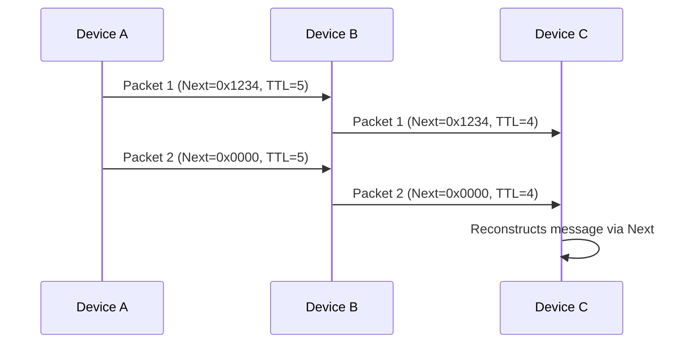
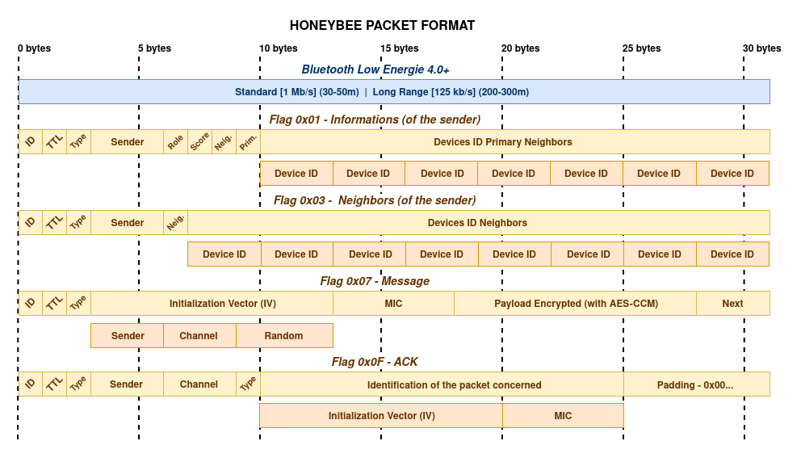
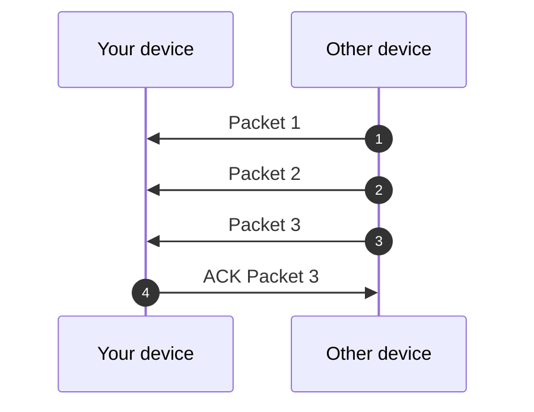
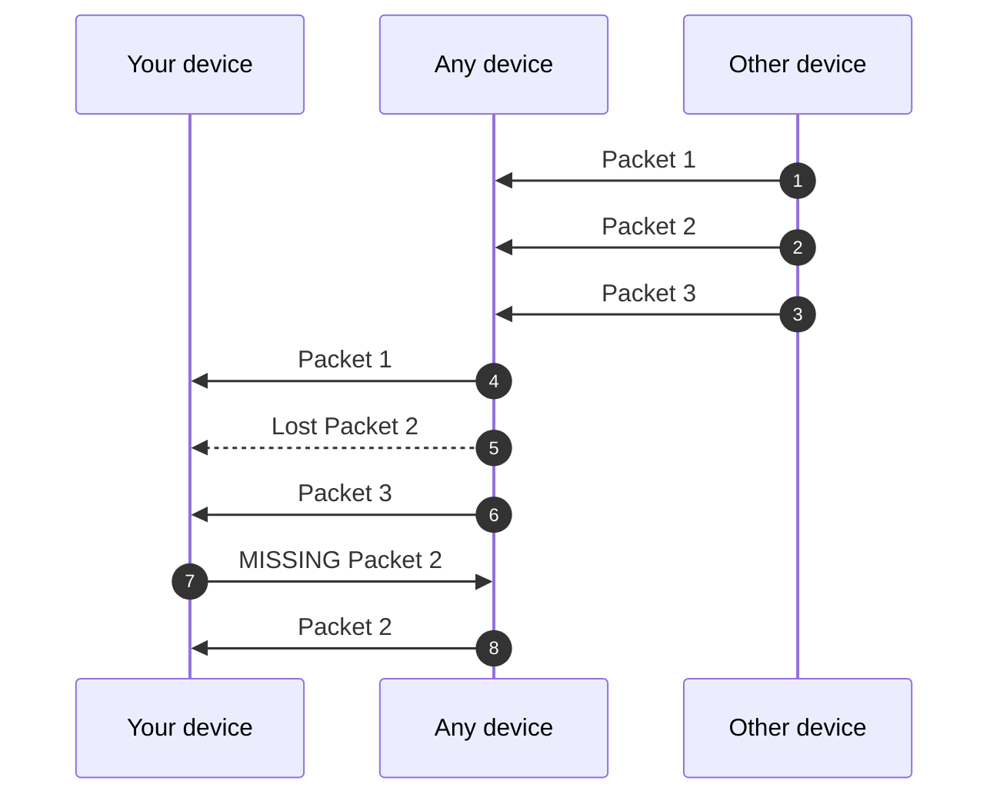

# Protocol Specification

1. [Introduction](#intro)
2. [Protocol Overview](#overview)
3. [Packet Structure](#structure)
4. [Security Mechanims](#security)
5. [Acknowledgement Mechanism](#acknowledgement)
6. [Relay Mechanism](#relay)
7. [Channel Mechanism](#channels)

---

## **1. Introduction** {#intro}

### **1.1 Purpose**

This document describes a **Bluetooth Low Energy (BLE)** protocol for:

- **Relay-based communication** between devices (ex: phone-to-phone).
- **Fragmented data transmission** (12-byte payloads linked via `next` fields).
- **Secure and anonymous** messaging (AES-CCM encryption, channel keys, integrity checks).

### **1.2 Prerequisites**

- Basic understanding of BLE and AES-CCM encryption.
- Familiarity with fragmentation and cryptographic hashing.

---

## **2. Protocol Overview** {#overview}

### **2.1 Resume**

| Concept           | Description                                                                             |
| ----------------- | --------------------------------------------------------------------------------------- |
| **Relay**         | Devices can relay packets to others, up to a **TTL (Time To Live)** limit.              |
| **Fragmentation** | Long messages are split into **10-byte payloads**, linked via a `next` field (2 bytes). |
| **Channel**        | Packets belong to a **channel** (3 byte), each with a unique encryption key.              |
| **Security**      | **AES-CCM-128** encryption, unique **IV**, and cryptographic `next` for integrity.      |

### **2.2 Comparison with Existing Standards**

|            | **HoneyBee**                   | **Bluetooth Mesh**   | **Thread**              | **Zigbee**             | **LoRaWAN**                 |
| --------------------- | ------------------------------------- | -------------------- | ----------------------- | ---------------------- | --------------------------- |
| **Provisioning**      | Pre-shared key | Dedicated    | Certificate / PSK           | Trust Center          | OTAA/ABP               |
| **Size Payload**     | Max 10 bytes        | Max 16 bytes                | Max 63 bytes            | Max 68 bytes                  | Max 51-222 bytes                       |
| **Security**          | AES-CCM-128   Channels             | AES-CCM-128          | AES-128   DTLS      | AES-128   Trust Center | AES-128   E2E optionnal* |
| **Range**            | ~30-50m _(BLE)_   ~300m _(BLE LongRange)_    | ~30-50m              | ~30-50m                 | ~10-100m               | ~1-40 km                 |
| **Latency**           | Low                 | Medium              | Low                  | Medium                | High         |

### **2.3 Communication Flow**

---

## **3. Packet Structure** {#structure}

### 3.0 Common Format (3 bytes)

| Field         | Bytes | Description                                        | Example              |
| ------------- | ----- | -------------------------------------------------- | -------------------- |
| **ID**        | 1     | Protocol identifier (`0xAA`).                      | `0xAA`               |
| **TTL**       | 1     | Number of allowed relays (decremented per relay).  | `0x05`               |
| **Type**     | 1     | Type of the packet.               | `0x01`               |

#### 3.0.1 ID

The first 8 bits of the frame. Used to identify the protocol. If the frame does not begin with `0xAA`, then the received packet uses a different protocol. You can automatically reject it.

#### 3.0.2 TTL

The TTL indicates the number of times the packet must be relayed by any device. It prevents the packet from traveling too far unnecessarily.

#### 3.0.3 Type

Type provide information about the type of packet?

| Bit    | Description |
| ------ | ----------- |
| `0x01` | Informations      |
| `0x03` | Neighbor |
| `0x07` | Message  |
| `0x0F` | ACK  |
| `0x1F` | _Reserved_  |
| `0x3F` | _Reserved_  |
| `0x7F` | _Reserved_  |
| `0xFF` | _Reserved_  |

### **3.1 Informations Format (31 bytes)**

| Field         | Bytes | Description                                        | Example              |
| ------------- | ----- | -------------------------------------------------- | -------------------- |
| **Sender**   | 3     | Identifiant of the sender.          | `0x123456`     |
| **Role**     | 1     | Primary `0x01` ou Secondary `0x02`.                          | `0x01`               |
| **Score**    | 1     |                   | `0x12`             |
| **Neighbor**       | 1     | Number of the neighbor.   | `0xA1`         |
| **Primary** | 1    | Number of the primary neighbor.    | `0x01`          |
| **Devices ID Primary** | 21    | Contains max seven (7) devices ID.    |             |

### **3.2 Neighbors Format (31 bytes)**

| Field         | Bytes | Description                                        | Example              |
| ------------- | ----- | -------------------------------------------------- | -------------------- |
| **Sender**   | 3     | Identifiant of the sender.          | `0x123456`     |
| **Neighbor**       | 1     | Number of the neighbor.   | `0xA1`         |
| **Devices ID Neighbor** | 24    | Contains max eight (8) devices ID.    |             |

### **3.3 Message Format (31 bytes)**

| Field         | Bytes | Description                                        | Example              |
| ------------- | ----- | -------------------------------------------------- | -------------------- |
| **Sender**   | 3     | Identifiant of the sender.          | `0x123456`     |
| **Channel**     | 3     | Identifiant of the channel.                          | `0x011145`               |
| **Random**    | 5     | Random number between 0 and 2^40.                  | `0x1234567890`             |
| **MIC**       | 5     | AES-CCM authentication tag. Message integrity check.   | `0xA1B2C3D4`         |
| **Encrypted** | 12    | Contains `Next (2) + Payload (10)` (encrypted).    | See below            |

#### 3.3.2 Channel (3 byte)

| **Type**             | **Binary Format**               | **Description**                                                            |
| -------------------- | ------------------------------- | -------------------------------------------------------------------------- |
| **Global**           | `1XXX XXXX XXXX XXXX XXXX XXXX` | Channels used for global communications. |
| **Community**        | `0001 XXXX XXXX XXXX XXXX XXXX` | Channels used to specific communities or organizations.               |
| **Team**             | `0000 0001 XXXX XXXX XXXX XXXX` | Channels used for teams or workgroups.                      |
| **Private**          | `0000 0000 0001 XXXX XXXX XXXX` | Channels for exchanges between a (very) small number of users.            |
| **Emergency**        | `0000 0000 0000 001X XXXX XXXX` | Priority channels for alerts or critical communications.                   |
| **Technical & Test** | `0000 0000 0000 0001 XXXX XXXX` | Channels used for testing, debugging, or technical uses.               |
| **Reserved**         | `0000 0000 0000 0000 1XXX XXXX` | Channels reserved.                              |

#### 3.3.3 Random (5 byte)

The randomly generated number serves two purposes:
- It prevents two packets sent over the network from having the same IV.
- It prevents an attacker from predicting the next IV packet.

#### 3.3.4 MIC (5 bytes)

AES-CCM authentication tag. Message integrity check.  

#### 3.3.5 Encrypted Payload (12 bytes)

| Field       | Bytes | Description                                                                   |
| ----------- | ----- | ----------------------------------------------------------------------------- |
| **Next**    | 2     | Link to next packet: `hash(channel + next_next + next_payload) % 2^16`.  `0x000000` for last packet. |
| **Payload** | 10    | Actual data.                                                                  |

Calculating the Next value strengthens the chain's integrity. By performing `hash(Channel + Next (next packet) + Payload (next packet))` in the packet's Next value, each packet is cryptographically linked to:
- Channel (to prevent confusion between channel).
- Next value of the following packet (to prevent packet reordering).
- Payload of the following packet (to prevent modifications).

Furthermore, an attacker can no longer replace a packet with one from a different channel, because the Next value would be different.

### **3.4 ACK Format (31 bytes)**

| Field         | Bytes | Description                                        | Example              |
| ------------- | ----- | -------------------------------------------------- | -------------------- |
| **Sender**   | 3     | Identifiant of the sender.          | `0x123456`     |
| **Channel**       | 3     | Identifiant of the channel.   | `0x123456`         |
| **IV** | 11    | Contains max eight (8) devices ID.    |             |
| **Type** | 1    | Type of the ACK.    | `0x04`            |

---

## **4. Security Mechanisms** {#security}

### **4.1 Encryption and Authentication**

- **Algorithm**: AES-CCM-128 (32-bytes key).
- **IV**: 11 bytes (`Sender (3) + Channel (3) + Random (5)`) for uniqueness.
- **MIC**: 4 bytes for authentication (tamper detection).

#### Initialization Vector (IV)

The IV (Initialization Vector) is a pseudo-random value used to ensure that the same plaintext encrypted twice with the same key produces two different ciphertexts. This prevents replication attacks.

#### Message integrity check (MIC)

The MIC is used in authenticated encryption modes such as AES-CCM to verify the integrity and authenticity of the encrypted message. It allows detection of whether the message has been modified during transmission.

### 4.2 Channel Management

Each channel has a unique encryption key (stored by sender/receiver).

#### Database
  
**Structure**  
Each field packet is stored in binary form in a file, with the following structure:
| Field      | Bytes           | Description                     |
|------------|-----------------|---------------------------------|
| Channel      | 3               | Identifiant of channel.    |
| Key        | 32              | Key of the channel.               |
  
**Size**  
35 bytes for each channel.  
  
**Format**  
- The file is a concatenation.
- Each channel is written sequentially.

### 4.3 Fragmentation with `Next`
  
**Principle**  
- Each packet contains a 2-byte `Next` field.
- `Next = hash(Channel + Next (next packet) + Payload (next packet))`.
- Last packet has `Next = 0x0000`.  
  
**Reconstruction**  
- Receiver verifies that `Next` of the previous packet matches the hash of the current payload.
- If a packet is missing or modified, the chain is invalid.
  
### **4.4 Anti-Replay and Integrity**

- **TTL**: Limits relay count (prevents infinite loops).
- **Cryptographic `Next`**: Prevents packet modification/reordering.
- **MIC**: Detects tampering.

Save the `IV` and `MIC` of the packet in database for prevent paquet replay.

#### Database
  
**Structure**  
Each field packet is stored in binary form in a file, with the following structure:
| Field      | Bytes           | Description                     |
|------------|-----------------|---------------------------------|
| IV      | 11               | IV of the packet.    |
| MIC        | 5               | Tag AES-CCM                     |
  
**Size**  
16 bytes for each packet.
  
**Format**  
- The file is a concatenation of packet fields.
- Each packet is written sequentially.
  
### 4.5 Risk of collision MIC

The probability of collision for a space of **N possible value** (here, $2^{40}$ for 40 bytes MIC) with **k packets** (here, $10^{9}$ for example) is approximated by :  
  
$P(\text{collision}) \approx 1 - e^{-k^2 / (2N)}$  
- $N = 2^{40}$ (number of possible MIC).  
- $k = 10^{9}$ (number of packet exchanged). 
  
$P(\text{collision}) \approx 1 - e^{-(10^9)^2 / (2 \times 2^{40})} \approx 1 - e^{-10^{18} / 2^{41}} \approx 1 - e^{-0.00045} \approx 0.00045$  

The probability of collision for a 40-bit MIC ($N = 2^{40}$) with 1 billion packets ($k = 10^9$) is approximately 0.045% (1 collision every ~220,000 packets).

---

## **5. Relay Mechanism** {#relay}
  
Each device relays the packets it receives, if the value of the TTL has not reached zero.  
  
The maximum number of relays is 255. If you use this value when sending a packet, it means it will pass through 255 devices (potentially multiple times the same device). At Long Range 125 kb/s, we can reach an average distance of up to 200 meters. 255 x 200 = 51,000 meters (51 km). But sometimes, we don't need to go that far; just a few hundred meters is enough, or 1-2 km. In this case, it's advisable to use a low TTL value (10-15) to avoid unnecessarily overloading the network.  
  
Even if the device has already received a package, it still returns it. On the other hand, if the device has already processed a package (so in its database) then it does not reprocess it a second time.  
  
The relayed packages follow the same logical ELODRI as the acknowledgement mechanism.  
  
The last 1000 packages are kept in memory, for the `MISSING` part of the acknowledgement mechanism. 1000 packages represent 1000 x 31 bytes = 31 000 bytes = minimum 31 kb in the RAM.  
  
---

## 6. Acknowledgement Mechanism {#acknowledgement}

> [Acknowledgement (data networks) - Wikipedia](https://en.wikipedia.org/wiki/Acknowledgement_(data_networks))

### Functioning

#### Lost ACK
If the ACK packet is lost, then nothing happens. Indeed, each packet is sent around the device; there are no specific intended recipients. The ACK serves to say, _"At least I received it!"_.

#### ELODRI logique (Ensure Least One Device Received It)
If after 5 minutes there is not at least one ACK indicating that the sent data has been correctly received, then the data is resent and another 5 minutes are waited. If after three attempts _(so, 15 minutes after the first send)_, the process is abandoned.

#### Priority
ACKs are processed with priority by the network.

### Types

| Bit    | Name | Description |
| ------ | ----------- | ------------- |
| `0x01` | Missing      | The receiving device did not receive the packet, or, one of the packet chain. |
| `0x03` | Unabled      | The receiving device **cannot process** the packet. |
| `0x07` | Denied        | The receiving device **will not process** the packet. |
| `0x0F` | Duplicated  | The receiving device already received this packet. |
| `0x1F` | Succeeded  | The receiving device has received the packet(s). |
| `0x3F` | Confirmed  | The sender device confirms receipt of the successful delivery. |
| `0x7F` | _Reserved_  | |
| `0xFF` | _Reserved_  | |

To confirm that we have received all the packets of a chain, we need to confirm with only the IV of the last packet of the chain.

If we are missing a packet, we must send an ACK packet with the type `MISSING` and the IV of the missing packet.

When a device receives a `MISSING`, it checks if it has the packet :
- If it has it, it doesn't relay the `MISSING` and sends the packet.
- If it doesn't have it, it relays the `MISSING`.

---

## 7. Channels Mechanism {#channels}

Each channel is identified by a **3-byte (24-bit) value**, and users can create channels following **typing conventions** based on the position of the first `1` bit in the binary representation of this value.

### 7.1. Channel Structure

#### 7.1.1. Channel Value Format

- **Size**: 3 bytes (24 bits).
- **Representation**: Unsigned integer (0x000000 to 0xFFFFFF).
- **Convention**: The position of the **first `1` bit** (from the left) determines the **channel type**.

#### 7.1.2. Channel Types

Channels are classified into **7 main types**, defined by the position of the first `1` in their binary value. Each type covers a **specific range of values**.

| **Type**             | **Binary Format**               | **Number of Channels** | **TTL** | **Description**                                                            |
| -------------------- | ------------------------------- | ---------------------- | ---------------------- | -------------------------------------------------------------------------- |
| **Global**           | `1XXX XXXX XXXX XXXX XXXX XXXX` | 8,388,608              | High| Channels used for global communications. |
| **Community**        | `0001 XXXX XXXX XXXX XXXX XXXX` | 2,097,152              | Medium| Channels used to specific communities or organizations.               |
| **Team**             | `0000 0001 XXXX XXXX XXXX XXXX` | 65,536                 | Low | Channels used for restricted teams or workgroups.                      |
| **Private**          | `0000 0000 0001 XXXX XXXX XXXX` | 4,096                  | Low | Channels for exchanges between a (very) small number of users.           |
| **Emergency**        | `0000 0000 0000 001X XXXX XXXX` | 2,048                  | Big | Priority channels for alerts or critical communications.                   |
| **Technical & Test** | `0000 0000 0000 0001 XXXX XXXX` | 256                    | Low| Channels used for testing, debugging, or technical uses.               |
| **Reserved**         | `0000 0000 0000 0000 1XXX XXXX` | 128                    | - | Channels reserved.                              |

> **Note**: Values from **`0x000000` to `0x00007F`** are **not assigned** to any type and should be considered **invalid** or reserved for system use.

#### 7.1.3. Communication Modes

The **last bit** (bit 0) of the channel value determines its **communication mode**:

- **Even (0)**: **Listen-only** (the node can only receive messages).
- **Odd (1)**: **Send + Listen** (the node can send and receive messages).

| **Mode**      | **Last Bit** | **Description**                                             |
| ------------- | ------------ | ----------------------------------------------------------- |
| Listen-only   | 0            | The node can only **receive** messages on this channel.     |
| Send + Listen | 1            | The node can **send and receive** messages on this channel. |

### **7.2. Rules**

#### **7.2.1. Value Assignment**

- Channel values **must be unique** within the same network.
- **Value ranges** must be respected to avoid conflicts between types.

#### **7.2.2. Mode Usage**

- **Listen-only (even)**:
  - Used for **broadcasts** (e.g., global announcements, read-only data streams).
  - Example: A **Global** channel in listen-only mode (`0x800000`) can be used to broadcast updates to all nodes.
- **Send + Listen (odd)**:
  - Used for **interactive communications** (e.g., discussions, commands).
  - Example: A **Team** channel in send+listen mode (`0x010001`) allows all team members to exchange messages.

#### **7.2.3. Priorities and Security**

- **Emergency** channels (`0x000800` – `0x000FFF`) should be **prioritized** in message processing.
- **Private** or **Reserved** channels should be **protected** by authentication or encryption mechanisms.
