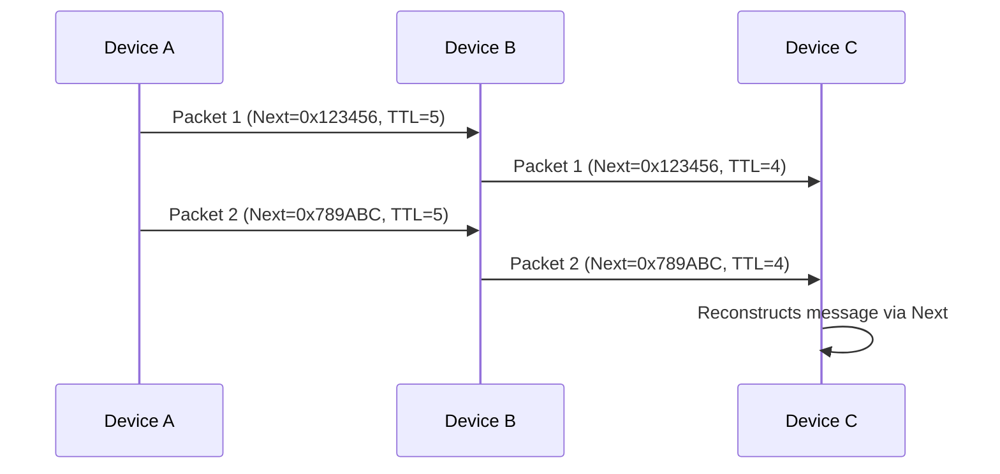

# Protocol Specification

---

## **1. Introduction**

### **1.1 Purpose**

This document describes a **Bluetooth Low Energy (BLE)** protocol for:

- **Relay-based communication** between devices (ex: phone-to-phone).
- **Fragmented data transmission** (12-byte payloads linked via `next` fields).
- **Secure and anonymous** messaging (AES-CCM encryption, group keys, integrity checks).

### **1.2 Prerequisites**

- Basic understanding of BLE and AES-CCM encryption.
- Familiarity with fragmentation and cryptographic hashing.

---

## **2. Protocol Overview**

### **2.1 Key Concepts**

| Concept           | Description                                                                             |
| ----------------- | --------------------------------------------------------------------------------------- |
| **Relay**         | Devices can relay packets to others, up to a **TTL (Time To Live)** limit.              |
| **Fragmentation** | Long messages are split into **12-byte payloads**, linked via a `next` field (3 bytes). |
| **Groups**        | Packets belong to a **group** (1 byte), each with a unique encryption key.              |
| **Security**      | **AES-CCM-128** encryption, unique **IV**, and cryptographic `next` for integrity.      |


### **2.2 Comparison with Existing Standards**


| Feature       | This Protocol | Bluetooth Mesh | Thread    |
| ------------- | ------------- | -------------- | --------- |
| Provisioning  | Not required  | Required       | Required  |
| Fragmentation | Yes (`next`)  | Yes            | Yes       |
| Relay         | Yes           | Yes            | Yes       |
| Compatibility | BLE 4.0+      | BLE 4.0+       | 802.15.4  |
| Complexity    | Low           | High           | Very High |


### **2.3 Communication Flow**



---

## **3. Packet Structure**

### **3.1 General Format (31 bytes)**


| Field         | Bytes | Description                                        | Example              |
| ------------- | ----- | -------------------------------------------------- | -------------------- |
| **ID**        | 1     | Protocol identifier (`0xAA`).                      | `0xAA`               |
| **TTL**       | 1     | Number of allowed relays (decremented per relay).  | `0x05`               |
| **Flags**     | 1     | 8-bit options (ex: `0x01` = urgent).             | `0x01`               |
| **Group**     | 1     | Encryption group (1-255).                          | `0x01`               |
| **IV**        | 8     | Initialization Vector: `Random (2) + Counter (6)`. | `0xABCD000000000001` |
| **Tag**       | 4     | AES-CCM authentication tag.                        | `0xA1B2C3D4`         |
| **Encrypted** | 15    | Contains `Next (3) + Payload (12)` (encrypted).    | See below            |


### **3.2 Encrypted Payload (15 bytes)**


| Field       | Bytes | Description                                                                   |
| ----------- | ----- | ----------------------------------------------------------------------------- |
| **Next**    | 3     | Link to next packet: `hash(next_payload) % 2^24`. `0x000000` for last packet. |
| **Payload** | 12    | Actual data.                                                                  |


### **3.3 Example Packet**

```
Header:
  - ID: 0xAA (Always)
  - TTL: 0x05 (5 relays max)
  - Flags: 0x00 (No flags)
  - Group: 0x12 (Local group)

IV:
  - Random: 0x0001
  - Counter: 0x00000000000001

Tag: 0xA1B2C3D4

Encrypted Payload:
  - Next: 0x123456 (Link to next packet)
  - Payload: 0x789ABC... (Encrypted data)
```

---

## **4. Security Mechanisms**

### **4.1 Encryption and Authentication**

- **Algorithm**: AES-CCM-128 (16-byte key).
- **IV**: 8 bytes (`Random (2) + Counter (6)`) for uniqueness.
- **Tag**: 4 bytes for authentication (tamper detection).

### 4.2 Group Management


| Group Range | Quantity | Type                | Example Use Case   |
| ----------- | -------- | ------------------- | ------------------ |
| 1-15        | 15       | Reserved            | -                  |
| 16-31       | 16       | Local Groups        | Friends, Family    |
| 32-63       | 32       | Organization Groups | Companies, Clubs   |
| 64-255      | 192      | Global Groups       | Regions, Countries |

- **Keys**: Each group has a unique encryption key (stored by sender/receiver).

### 4.3 Fragmentation with `Next`

- **Principle**:
  - Each packet contains a 3-byte `Next` field.
  - `Next = hash(next_payload) % 2^24`.
  - Last packet has `Next = 0x000000`.
- **Reconstruction**:
  - Receiver verifies that `Next` of the previous packet matches the hash of the current payload.
  - If a packet is missing or modified, the chain is invalid.

### **4.4 Anti-Replay and Integrity**

- **TTL**: Limits relay count (prevents infinite loops).
- **Cryptographic `Next`**: Prevents packet modification/reordering.
- **AES-CCM Tag**: Detects tampering.

---

## **5. Relay Mechanism**

### **5.1 Relay Rules**

1. **Check TTL**:
  - If `TTL == 0`, do not relay.
  - Else, decrement TTL by 1.
2. **Re-transmit the packet**:
  - Preserve all fields (ID, Flags, Group, IV, Tag, Encrypted Payload, ...).

---


## **6. Limitations and Best Practices**

### **6.1 Limitations**


| Limitation    | Impact                           | Solution?                                       |
| ------------- | -------------------------------- | ---------------------------------------------- |
| Packet Size   | 31 bytes max (BLE 4.0+).         | Use only Bluetooth 5.0+ for 255 bytes.                                          |
| Range         | ~30-50m (standard BLE).          | Use BLE Long Range (125 kbps).             |
| Latency       | Higher in Long Range (125 kbps). | Use 500 kbps if shorter range suffices.    |
| Compatibility | Bluetooth 4.0 does not use Long Range.                             | Provide a fallback mode. |


### **6.2 Best Practices**

1. **Generate unique IVs**:
  - Use `Device Address + Random + Counter`.
2. **Rotate keys regularly** (if possible):
  - Use **session keys** (time-limited).
3. **Limit TTL**:
  - Avoid infinite loops (ex: TTL = max 10-15).
4. **Validate `Next`**:
  - Always check that `Next` of the previous packet matches the current payload's hash.
5. **Test in real conditions**:
  - Verify range and power consumption.

---

## **7. Glossary**


| Term        | Definition                                                                   |
| ----------- | ---------------------------------------------------------------------------- |
| **BLE**     | Bluetooth Low Energy: Wireless protocol for low-power devices.               |
| **AES-CCM** | Advanced Encryption Standard - Counter Mode with CBC-MAC for authentication. |
| **IV**      | Initialization Vector: Unique value for encryption.                          |
| **TTL**     | Time To Live: Number of allowed relays for a packet.                         |
| **Next**    | 3-byte field linking a packet to the next via cryptographic hash.            |
| **Group**   | Group identifier for selecting the encryption key.                           |