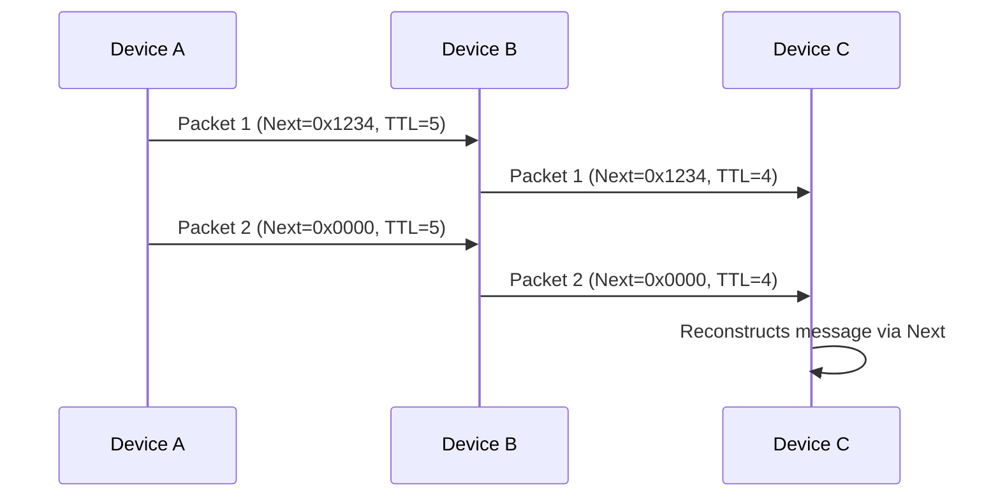

# Protocol Specification

1. [Introduction](#intro)
2. [Protocol Overview](#overview)
3. [Mechanisms](#mechanisms)

---

## **1. Introduction** {#intro}

### **1.1 Purpose**

This document describes a **Bluetooth Low Energy (BLE)** protocol for:

- **Relay-based communication** between devices (ex: phone-to-phone).
- **Fragmented data transmission** (12-byte payloads linked via `next` fields).
- **Secure and anonymous** messaging (AES-CCM encryption, channel keys, integrity checks).

### **1.2 Prerequisites**

- Basic understanding of BLE and AES-CCM encryption.
- Familiarity with fragmentation and cryptographic hashing.

---

## **2. Protocol Overview** {#overview}

### **2.1 Resume**

| Concept           | Description                                                                             |
| ----------------- | --------------------------------------------------------------------------------------- |
| **Relay**         | Devices can relay packets to others, up to a **TTL (Time To Live)** limit.              |
| **Fragmentation** | Long messages are split into **10-byte payloads**, linked via a `next` field (2 bytes). |
| **Channel**        | Packets belong to a **channel** (3 byte), each with a unique encryption key.              |
| **Security**      | **AES-CCM-128** encryption, unique **IV**, and cryptographic `next` for integrity.      |

### **2.2 Comparison with Existing Standards**

|            | **HoneyBee**                   | **Bluetooth Mesh**   | **Thread**              | **Zigbee**             | **LoRaWAN**                 |
| --------------------- | ------------------------------------- | -------------------- | ----------------------- | ---------------------- | --------------------------- |
| **Provisioning**      | Pre-shared key | Dedicated    | Certificate / PSK           | Trust Center          | OTAA/ABP               |
| **Size Payload**     | Max 10 bytes        | Max 16 bytes                | Max 63 bytes            | Max 68 bytes                  | Max 51-222 bytes                       |
| **Security**          | AES-CCM-128   Channels             | AES-CCM-128          | AES-128   DTLS      | AES-128   Trust Center | AES-128   E2E optionnal* |
| **Range**            | ~30-50m _(BLE)_   ~300m _(BLE LongRange)_    | ~30-50m              | ~30-50m                 | ~10-100m               | ~1-40 km                 |
| **Latency**           | Low                 | Medium              | Low                  | Medium                | High         |

### **2.3 Communication Flow**

---

## 3. Mechanisms {#mechanisms}

- [Acknowledgement Mechanism](mechanisms/ACKNOWLEDGEMENT.md)
- [Channels Mechanism](mechanisms/CHANNELS.md)
- [Identification Mechanism](mechanisms/IDENTIFICATION.md)
- [Network Mechanism](mechanisms/NETWORK.md)
- [Packet Mechanism](mechanisms/PACKET.md)
- [Relay Mechanism](mechanisms/RELAY.md)
- [Confidentiality Mechanism](mechanisms/CONFIDENTIALITY.md)