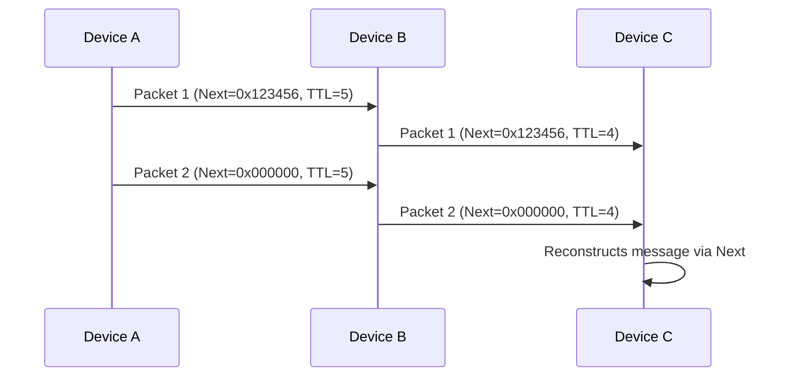
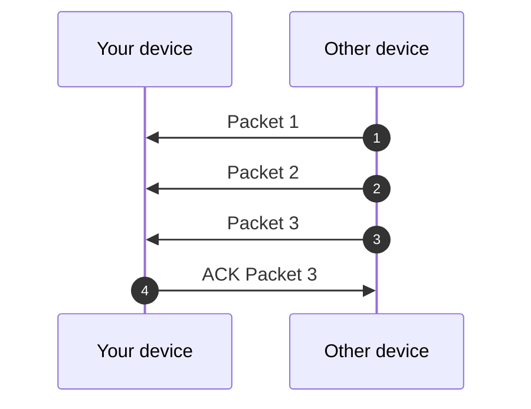
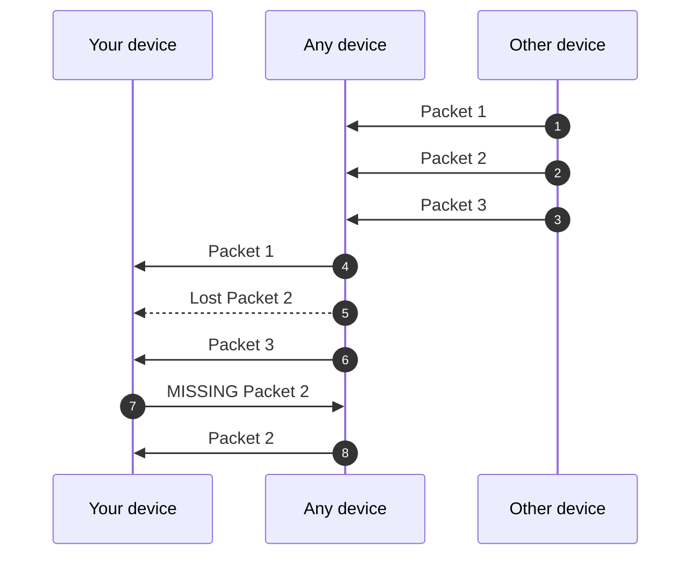
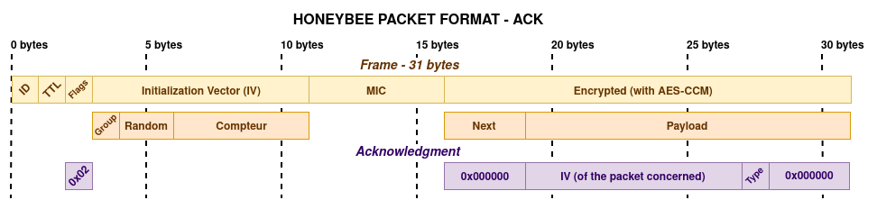

# Protocol Specification

---

## **1. Introduction**

### **1.1 Purpose**

This document describes a **Bluetooth Low Energy (BLE)** protocol for:

- **Relay-based communication** between devices (ex: phone-to-phone).
- **Fragmented data transmission** (12-byte payloads linked via `next` fields).
- **Secure and anonymous** messaging (AES-CCM encryption, group keys, integrity checks).

### **1.2 Prerequisites**

- Basic understanding of BLE and AES-CCM encryption.
- Familiarity with fragmentation and cryptographic hashing.

---

## **2. Protocol Overview**

### **2.1 Key Concepts**

| Concept           | Description                                                                             |
| ----------------- | --------------------------------------------------------------------------------------- |
| **Relay**         | Devices can relay packets to others, up to a **TTL (Time To Live)** limit.              |
| **Fragmentation** | Long messages are split into **12-byte payloads**, linked via a `next` field (3 bytes). |
| **Groups**        | Packets belong to a **group** (1 byte), each with a unique encryption key.              |
| **Security**      | **AES-CCM-128** encryption, unique **IV**, and cryptographic `next` for integrity.      |


### **2.2 Comparison with Existing Standards**

|            | **HoneyBee**                   | **Bluetooth Mesh**   | **Thread**              | **Zigbee**             | **LoRaWAN**                 |
| --------------------- | ------------------------------------- | -------------------- | ----------------------- | ---------------------- | --------------------------- |
| **Provisioning**      | Pre-shared key | Dedicated    | Certificate / PSK           | Trust Center          | OTAA/ABP               |
| **Size Payload**     | Max 12 bytes        | Max 16 bytes                | Max 63 bytes            | Max 68 bytes                  | Max 51-222 bytes                       |
| **Security**          | AES-CCM-128 </br> Groups             | AES-CCM-128          | AES-128 </br> DTLS      | AES-128 </br> Trust Center | AES-128 </br> E2E optionnal* |
| **Range**            | ~30-50m _(BLE)_ </br> ~300m _(BLE LongRange)_    | ~30-50m              | ~30-50m                 | ~10-100m               | ~1-40 km                 |
| **Latency**           | Low                 | Medium              | Low                  | Medium                | High         |


### **2.3 Communication Flow**



---

## **3. Packet Structure**

### **3.1 General Format (31 bytes)**

| Field         | Bytes | Description                                        | Example              |
| ------------- | ----- | -------------------------------------------------- | -------------------- |
| **ID**        | 1     | Protocol identifier (`0xAA`).                      | `0xAA`               |
| **TTL**       | 1     | Number of allowed relays (decremented per relay).  | `0x05`               |
| **Flags**     | 1     | 8-bit options (ex: `0x01` = urgent).               | `0x01`               |
| **Group**     | 1     | Encryption group (1-255).                          | `0x01`               |
| **Random**    | 2     | Random number between 0 and 2^16.                  | `0xABCD`             |
| **Counter**   | 5     | Incremente by one for each create packet.          | `0x000000000001`     |
| **MIC**       | 5     | AES-CCM authentication tag. Message integrity check.   | `0xA1B2C3D4`         |
| **Encrypted** | 15    | Contains `Next (3) + Payload (12)` (encrypted).    | See below            |

### 3.2 ID

The first 8 bits of the frame. Used to identify the protocol. If the frame does not begin with `0xAA`, then the received packet uses a different protocol. You can automatically reject it.

### 3.3 TTL

The TTL indicates the number of times the packet must be relayed by any device. It prevents the packet from traveling too far unnecessarily.

### 3.4 Flags

Flags provide information about the type of packet, for example, whether it is urgent.

| Bit    | Description |
| ------ | ----------- |
| `0x01` | Urgent      |
| `0x02` | Acknowledgement |
| `0x04` | _Reserved_  |
| `0x08` | _Reserved_  |
| `0x10` | _Reserved_  |
| `0x20` | _Reserved_  |
| `0x40` | _Reserved_  |
| `0x80` | _Reserved_  |

### 3.6 Group (1 byte)

| Group Range | Quantity | Type                | Example Use Case   |
| ----------- | -------- | ------------------- | ------------------ |
| 1-15        | 15       | Reserved            | -                  |
| 16-31       | 16       | Local Groups        | Friends, Family    |
| 32-63       | 32       | Organization Groups | Companies, Clubs   |
| 64-255      | 192      | Global Groups       | Regions, Countries |

### 3.7 Random (1 byte)

The randomly generated number serves two purposes:
- It prevents two packets sent over the network from having the same IV if they haven't yet been synchronized to the latest value of the group's counter.
- It prevents an attacker from predicting the next IV packet.

### 3.8 Counter (5 bytes)

Incremente by one for each create packet.

### 3.9 MIC (5 bytes)

AES-CCM authentication tag. Message integrity check.  

### 3.10 Encrypted Payload (15 bytes)

| Field       | Bytes | Description                                                                   |
| ----------- | ----- | ----------------------------------------------------------------------------- |
| **Next**    | 3     | Link to next packet: `hash(group + next_next + next_payload) % 2^24`. </br>`0x000000` for last packet. |
| **Payload** | 12    | Actual data.                                                                  |

Calculating the Next value strengthens the chain's integrity. By performing `hash(Group + Next (next packet) + Payload (next packet))` in the packet's Next value, each packet is cryptographically linked to:
- Group (to prevent confusion between groups).
- Next value of the following packet (to prevent packet reordering).
- Payload of the following packet (to prevent modifications).

Furthermore, an attacker can no longer replace a packet with one from a different group, because the Next value would be different.

### **3.11 Example Packet**

```
Header:
  - ID: 0xAA (Always)
  - TTL: 0x05 (5 relays max)
  - Flags: 0x00 (No flags)
  - Group: 0x12 (Local group)

IV:
  - Random: 0x0001
  - Counter: 0x0000000001

MIC: 0xA1B2C3D4E5

Encrypted Payload:
  - Next: 0x123456 (Link to next packet)
  - Payload: 0x789ABC... (Encrypted data)
```

---

## **4. Security Mechanisms**

### **4.1 Encryption and Authentication**

- **Algorithm**: AES-CCM-128 (32-bytes key).
- **IV**: 8 bytes (`Group (1) + Random (2) + Counter (5)`) for uniqueness.
- **MIC**: 4 bytes for authentication (tamper detection).

#### Initialization Vector (IV)

The IV (Initialization Vector) is a pseudo-random value used to ensure that the same plaintext encrypted twice with the same key produces two different ciphertexts. This prevents replication attacks.

#### Message integrity check (MIC)

The MIC is used in authenticated encryption modes such as AES-CCM to verify the integrity and authenticity of the encrypted message. It allows detection of whether the message has been modified during transmission.

### 4.2 Group Management

| Group Range | Quantity | Type                | Example Use Case   |
| ----------- | -------- | ------------------- | ------------------ |
| 1-15        | 15       | Reserved            | -                  |
| 16-31       | 16       | Local Groups        | Friends, Family    |
| 32-63       | 32       | Organization Groups | Companies, Clubs   |
| 64-255      | 192      | Global Groups       | Regions, Countries |

- **Keys**: Each group has a unique encryption key (stored by sender/receiver).

#### Database
  
**Structure**  
Each field packet is stored in binary form in a file, with the following structure:
| Field      | Bytes           | Description                     |
|------------|-----------------|---------------------------------|
| Group      | 1               | Identifiant of group (0-255)    |
| Key        | 32              | Counter of packet               |
  
**Size**  
33 bytes for each group.  
  
**Format**  
- The file is a concatenation.
- Each group is written sequentially.

### 4.3 Fragmentation with `Next`
  
**Principle**  
- Each packet contains a 3-byte `Next` field.
- `Next = hash(Group + Next (next packet) + Payload (next packet))`.
- Last packet has `Next = 0x000000`.  
  
**Reconstruction**  
- Receiver verifies that `Next` of the previous packet matches the hash of the current payload.
- If a packet is missing or modified, the chain is invalid.
  
### **4.4 Anti-Replay and Integrity**

- **TTL**: Limits relay count (prevents infinite loops).
- **Cryptographic `Next`**: Prevents packet modification/reordering.
- **MIC**: Detects tampering.

Save the `Group`, `Counter` and `MIC` of the packet in database for prevent paquet replay.

#### Database
  
**Structure**  
Each field packet is stored in binary form in a file, with the following structure:
| Field      | Bytes           | Description                     |
|------------|-----------------|---------------------------------|
| Group      | 1               | Identifiant of group (0-255)    |
| Counter    | 5               | Counter of packet               |
| MIC        | 5               | Tag AES-CCM                     |
  
**Size**  
11 bytes for each packet.
  
**Format**  
- The file is a concatenation of packet fields.
- Each packet is written sequentially.
  
### 4.5 Risk of collision

The probability of collision for a space of **N possible value** (here, $2^{40}$ for 40 bytes MIC) with **k packets** (here, $10^{9}$ for example) is approximated by :  
  
$P(\text{collision}) \approx 1 - e^{-k^2 / (2N)}$  
- $N = 2^{40}$ (number of possible MIC).  
- $k = 10^{9}$ (number of packet exchanged). 
  
$P(\text{collision}) \approx 1 - e^{-(10^9)^2 / (2 \times 2^{40})} \approx 1 - e^{-10^{18} / 2^{41}} \approx 1 - e^{-0.00045} \approx 0.00045$  

The probability of collision for a 40-bit MIC ($N = 2^{40}$) with 1 billion packets ($k = 10^9$) is approximately 0.045% (1 collision every ~220,000 packets).

---

## **5. Relay Mechanism**

1. **Check TTL**:
  - If `TTL == 0`, do not relay.
  - Else, decrement TTL by 1.
2. **Re-transmit the packet**:
  - Preserve all fields (ID, Flags, Group, IV, MIC, Encrypted Payload, ...).

---

## 6. Acknowledgement Mechanism

> [Acknowledgement (data networks) - Wikipedia](https://en.wikipedia.org/wiki/Acknowledgement_(data_networks))

### Functioning

If the ACK packet is lost, then nothing happens. Indeed, each packet is sent around the device; there are no specific intended recipients. The ACK serves to say, _"At least I received it!"_.

If after 5 minutes there is not at least one ACK indicating that the sent data has been correctly received, then the data is resent and another 5 minutes are waited. If after three attempts _(so, 15 minutes after the first send)_, the process is abandoned.

ACKs are processed with priority by the network (equivalent to the flag `Urgent 0x01`).

### Types

| Bit    | Name | Description |
| ------ | ----------- | ------------- |
| `0x01` | Missing      | The receiving device did not receive the packet, or, one of the packet chain. |
| `0x03` | Unabled      | The receiving device **cannot process** the packet. |
| `0x07` | Denied        | The receiving device **will not process** the packet. |
| `0x0F` | Duplicated  | The receiving device already received this packet. |
| `0x1F` | Succeeded  | The receiving device has received the packet(s). |
| `0x3F` | Confirmed  | The sender device confirms receipt of the successful delivery. |
| `0x7F` | _Reserved_  | |
| `0xFF` | _Reserved_  | |

To confirm that we have received all the packets of a chain, we need to confirm with only the IV of the last packet of the chain.



If we are missing a packet, we must send an ACK packet with the type `MISSING` and the IV of the missing packet.

When a device receives a `MISSING`, it checks if it has the packet :
- If it has it, it doesn't relay the `MISSING` and sends the packet.
- If it doesn't have it, it relays the `MISSING`.



### Exemple frame



---

## 7. Limitations and Best Practices

### **7.1 Limitations**

| Limitation    | Impact                           | Solution?                                       |
| ------------- | -------------------------------- | ---------------------------------------------- |
| Packet Size   | 31 bytes max (BLE 4.0+).         | Use only Bluetooth 5.0+ for 255 bytes.                                          |
| Range         | ~30-50m (standard BLE).          | Use BLE Long Range (125 kbps).             |
| Latency       | Higher in Long Range (125 kbps). | Use 500 kbps if shorter range suffices.    |
| Compatibility | Bluetooth 4.0 does not use Long Range.                             | Provide a fallback mode. |

### **7.2 Best Practices**

1. **Generate unique IVs**:
  - Use `Group + Random + Counter`.
2. **Rotate keys regularly** (if possible):
  - Use **session keys** (time-limited).
3. **Limit TTL**:
  - Avoid infinite loops (ex: TTL = max 10-15).
4. **Validate `Next`**:
  - Always check that `Next` of the previous packet matches the current payload's hash.
5. **Test in real conditions**:
  - Verify range and power consumption.

---

## **8. Glossary**

| Term        | Definition                                                                   |
| ----------- | ---------------------------------------------------------------------------- |
| **BLE**     | Bluetooth Low Energy: Wireless protocol for low-power devices.               |
| **AES-CCM** | Advanced Encryption Standard - Counter Mode with CBC-MAC for authentication. |
| **IV**      | Initialization Vector: Unique value for encryption.                          |
| **TTL**     | Time To Live: Number of allowed relays for a packet.                         |
| **Next**    | 3-byte field linking a packet to the next via cryptographic hash.            |
| **Group**   | Group identifier for selecting the encryption key.                           |