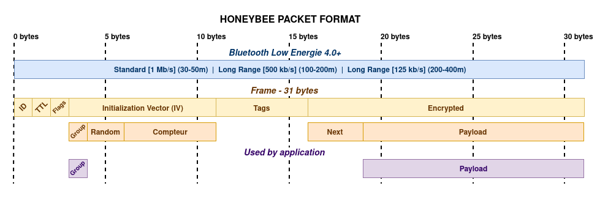

<h1>HoneyBee 🐝</h1>


**A lightweight, (secure?), and relay-based Bluetooth Low Energy (BLE) protocol for fragmented, anonymous, and encrypted communication between devices.**

> It is an experimental protocol and not an official standard. No security checks by a specialized audit.

---

## **Overview**

It is designed for:
- **Device-to-device relaying** (ex: phone-to-phone).
- **Secure data transmission** (AES-CCM encryption, group-based keys).
- **Fragmentation** of long messages into 12-byte payloads, linked via cryptographic `next` fields.
- **Secure P2P messaging** with fragmentation and relay (ex: offline chat).

Key Features:
- **Easy and low provisioning**.
- **Low complexity** (suitable for embedded and mobile devices).
- **Anti-replay and integrity checks** (TTL, cryptographic `next`, AES-CCM tags).

Not Ideal for:
- Long-range IoT.
- High-throughput applications.
- Standardized, interoperable solutions.
- Large-scale deployments with dynamic group joining.



---

## **Documentation**

| Document                                 | Description                                                                       |
| ---------------------------------------- | --------------------------------------------------------------------------------- |
| [PROTOCOL.md](PROTOCOL.md)               | Technical specification of the protocol (packet structure, encryption, relaying). |
| [IMPLEMENTATION.md](IMPLEMENTATION.md) | Code examples (Python, Kotlin) and integration guidelines.                        |
| [USAGE.md](USAGE.md)                   | Step-by-step guide for sending/receiving messages.                                |
| [SECURITY.md](SECURITY.md)                   | Know security issues.                                |

---

## **Project Structure**

```
honeybee/
|─ README.md               # This file
|─ PROTOCOL.md             # Protocol specification
|─ IMPLEMENTATION.md       # Code examples
|─ USAGE.md                # Usage guide
|─ SECURITY.md             # Security issues
|─ logo_honeybee.png       # Logo of the protocol
|─ LICENSE                 # SOON
```
