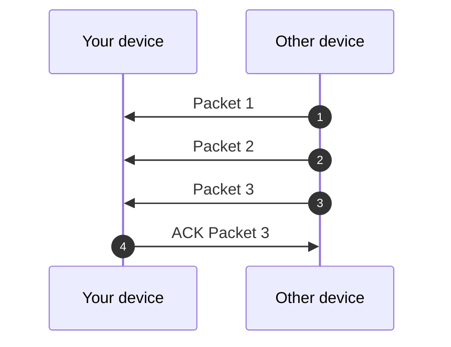
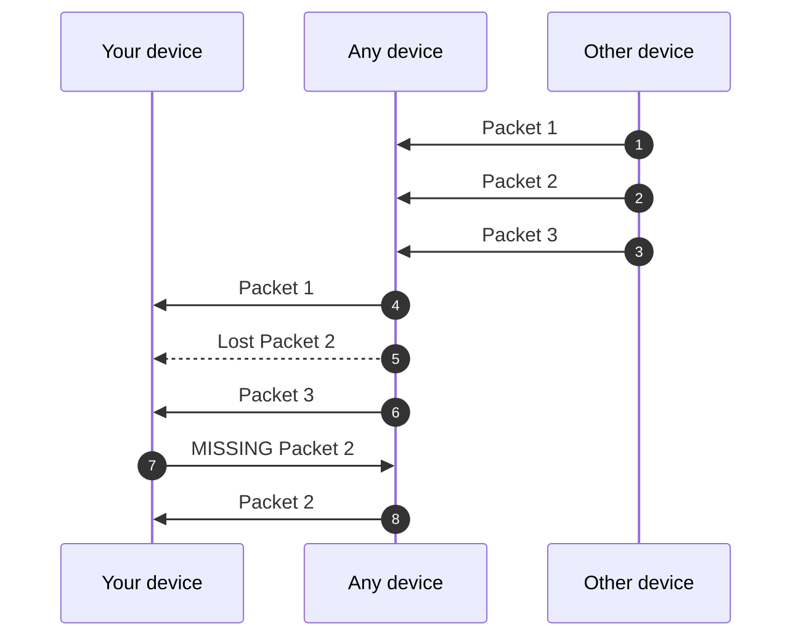

## Acknowledgement Mechanism

> [Acknowledgement (data networks) - Wikipedia](https://en.wikipedia.org/wiki/Acknowledgement_(data_networks))

### Functioning

#### Lost ACK
If the ACK packet is lost, then nothing happens. Indeed, each packet is sent around the device; there are no specific intended recipients. The ACK serves to say, _"At least I received it!"_.

#### ELODRI logique (Ensure Least One Device Received It)

If we only wait to receive an ACK MISSING packet before resending a data packet, it's problematic if our data packet is lost without anyone receiving it. To increase the chances of a device receiving it, in backend task asynchronous, if after $TTL \times 500\text{ms}$ there is not at least one ACK indicating that the sent data has been correctly received, then the data is resent and another $TTL \times 500\text{ms}$  are waited. If after three attempts _(so, $3 \times TTL \times 500\text{ms}$  after the first send, four packets sent in total)_, the process is abandoned.

#### Priority
ACKs are processed with priority by the network.

### Types

| Bit    | Name | Description |
| ------ | ----------- | ------------- |
| `0x01` | Missing      | The receiving device did not receive the packet, or, one of the packet chain. |
| `0x03` | Unabled      | The receiving device **cannot process** the packet. |
| `0x07` | Denied        | The receiving device **will not process** the packet. |
| `0x0F` | Duplicated  | The receiving device already received this packet. |
| `0x1F` | Succeeded  | The receiving device has received the packet(s). |
| `0x3F` | Confirmed  | The sender device confirms receipt of the successful delivery. |
| `0x7F` | _Reserved_  | |
| `0xFF` | _Reserved_  | |

To confirm that we have received all the packets of a chain, we need to confirm with only the IV of the last packet of the chain.

If we are missing a packet, we must send an ACK packet with the type `MISSING` and the IV of the missing packet.

When a device receives a `MISSING`, it checks if it has the packet :
- If it has it, it doesn't relay the `MISSING` and sends the packet.
- If it doesn't have it, it relays the `MISSING`.

