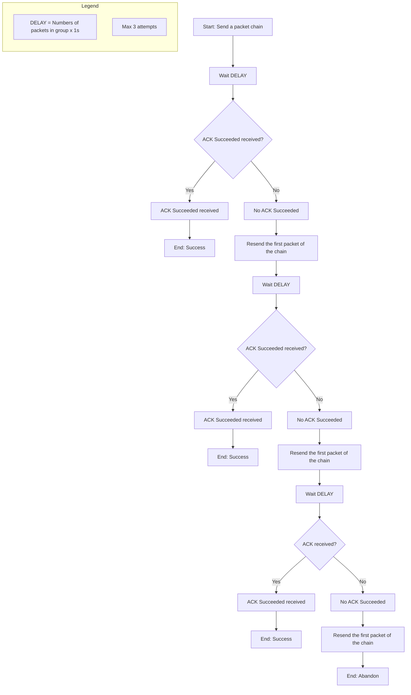
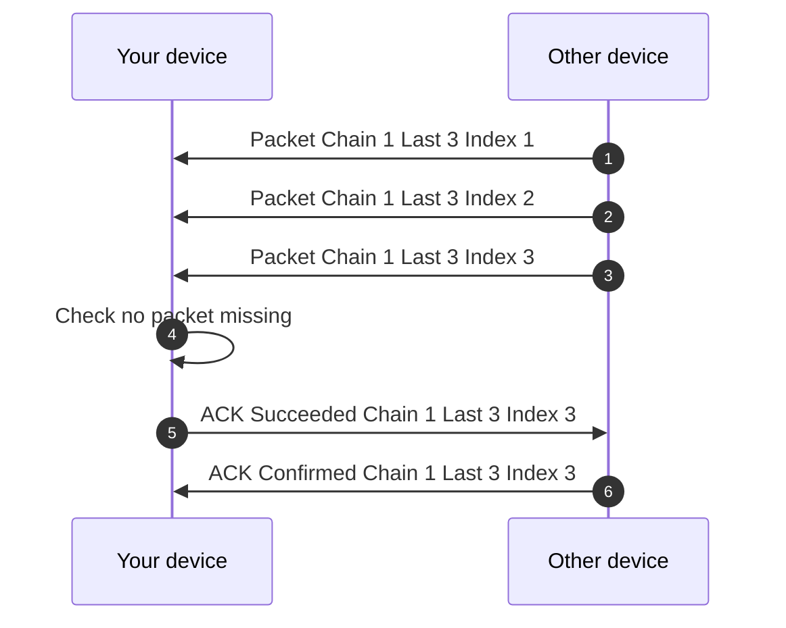
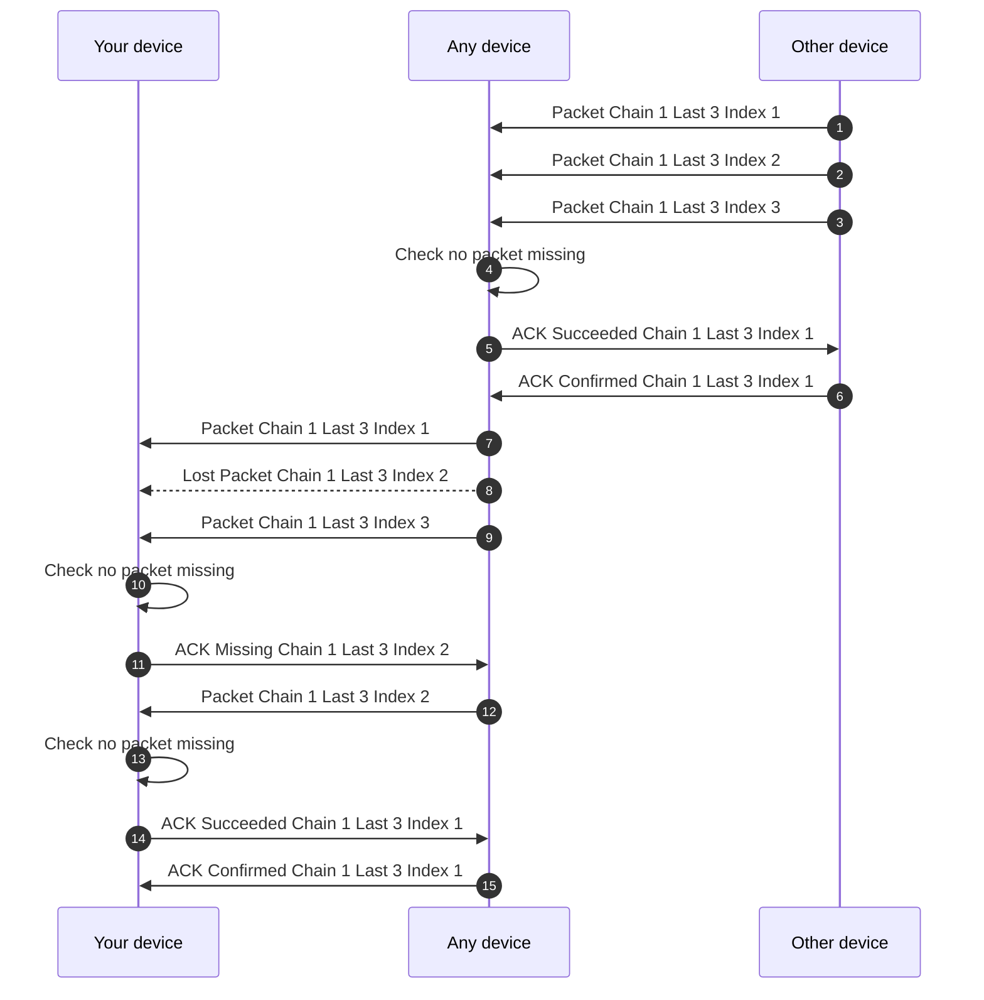

## Acknowledgement Mechanism  
  
> [Acknowledgement (data networks) - Wikipedia](https://en.wikipedia.org/wiki/Acknowledgement_(data_networks))

### Functioning

#### Lost ACK
If the ACK packet is lost, then nothing happens. Indeed, each packet is sent around the device; there are no specific intended recipients. The ACK serves to say, _"At least I received it!"_.

#### ELODRI logique (Ensure Least One Device Received It)

If we only wait to receive an ACK MISSING packet before resending a data packet, it's problematic if our data packet is lost without anyone receiving it. To increase the chances of a device receiving it, if after $\mathrm{Numbers\\_of\\_packets\\_in\\_chain} \times 1\mathrm{s}$ of the last packet in the chain send, there is not at least one `ACK Successed`, then the first packet of the `Chain` is resent and another $\mathrm{Numbers\\_of\\_packets\\_in\\_chain} \times 1\mathrm{s}$ are waited. If after three attempts the process is abandoned.

#### Priority
ACKs are processed with priority by the network.

### Types

| Bit    | Name        | Description |
| ------ | ----------- | ------------------------------------------------------------- |
| `0x01` | Missing     | The receiving device did not receive the packet.              |
| `0x03` | Unabled     | The receiving device **cannot process** the packet.           |
| `0x07` | Denied      | The receiving device **will not process** the packet.         |
| `0x0F` | Duplicated  | The receiving device already received this packet.            |
| `0x1F` | Succeeded   | The receiving device has received the entire packet(s) group. |
| `0x3F` | Confirmed   | The sender device confirm has received the ACK Succeeded.     |
| `0x7F` | _Reserved_  | |
| `0xFF` | _Reserved_  | |

If we are missing a packet, we must send an ACK packet with the type `MISSING` and the IV of the missing packet.

When a device receives a `MISSING`, it checks if it has the packet :
- If it has it, it doesn't relay the `MISSING` and sends the packet.
- If it doesn't have it, it relays the `MISSING`.

